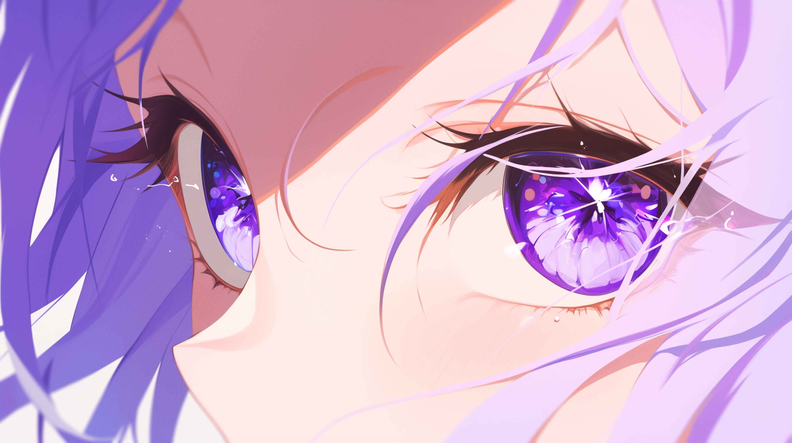

## 世界アーカイブへようこそ。

<!--

-->
<!---->

これはこの世界専用のアーカイブ集だ。お前には理解できん。

<ul>
  
    <li><a href="{{ post.url | relative_url }}">{{ post.title }}</a></li>
  
</ul>

 
 

<a class="left" href="/blog/">← Previous</a>

<a onclick="topFunction()" id="btn-to-top">Top</a> 
